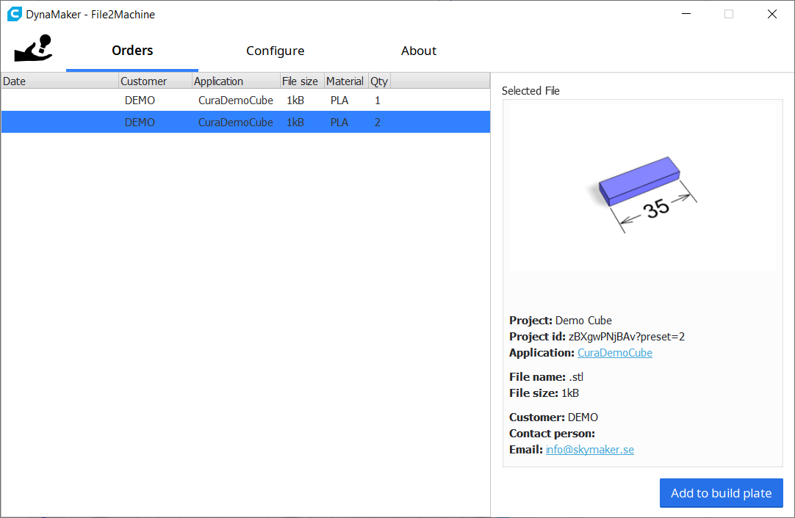

*Public Repo*
# Dynamaker Integration for Cura
Streamlines the process of importing manufacturing files from online configurators by providing an integrated file queue with direct import and order details. Perfect for small business owners or hobbyists looking for an easy way to import orders directly into Cura.

## Installation
- **Marketplace** (recommended): Look for "DynaMaker CAD configurator integration" in the Cura Marketplace, select it, click on "install" and restart Cura.
- **Manual**: Clone and unzip this repository into your local plugins folder. You can find this folder from Cura by navigating to *help*->*Show Configuration Folder*, and then selecting the plugins folder. Restart Cura when done.

## Usage
Once installed, you should be able to open the File Queue from *extensions*->*DynaMaker*->*file2Machine* in Cura. 

## About
This plugin is developed by the Swedish mass customization engineers at <a href='https://www.skymaker.se/'>SkyMaker AB</a> to help bridge the gap between online configurators and additive manufacturing. Since the team always have had a faithful Ultimaker 2 trudging on at the office being exposed to numerous experiments and prototypes, the Cura platform was a natural place to start releasing some of the results from our internal development.

## Feedback & Bugs
Please send feedback and bugs to <a href='mailto:info@skymaker.se'>info@skymaker.se</a>!

## Resources
[DynaMaker.com](https://dynamaker.com/)  
[file2machine.com](https://file2machine.com/)

## Preview
